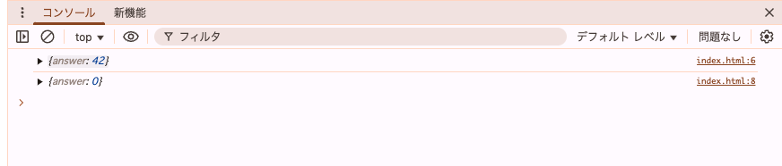
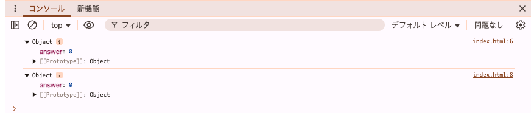

## 問題1.4の何が表示されるか予想

1つ目のコンソールログ => {answer: 42}
 
2つ目のコンソールログ => {answer: 0}

## HTMLと開発者ツールの開く順序ごとの結果比較

### 開発者ツール → HTML

1つ目のコンソールログ => {answer: 42}
 
2つ目のコンソールログ => {answer: 0}
 

### HTML → 開発者ツール

1つ目のコンソールログ => {answer: 0}
 
2つ目のコンソールログ => {answer: 0}
 

## 常に結果した結果を得るための修正

### 順序ごとに結果が異なる原因

console.logで得られる結果が違う理由は HTML → 開発者ツール の場合、結果を展開した段階での結果を表示してしまうため値が変更された後の0が両方ともに入ってしまう 
参考：https://qiita.com/POPOPON/items/edc7a522d2ee9a50cc3a 

### 修正内容

上記の参考にある[解決方法](https://qiita.com/POPOPON/items/edc7a522d2ee9a50cc3a#-%E4%B8%80%E5%BA%A6%E6%96%87%E5%AD%97%E5%88%97%E3%81%AB%E5%A4%89%E6%8F%9B%E3%81%99%E3%82%8B)によると 
`console.log(JSON.parse(JSON.stringify(obj)));`に修正すると呼び出した時点の値を表示することができる 

修正後のHTML:[index_fixed.html](index_fixed.html)
