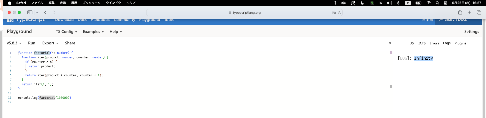
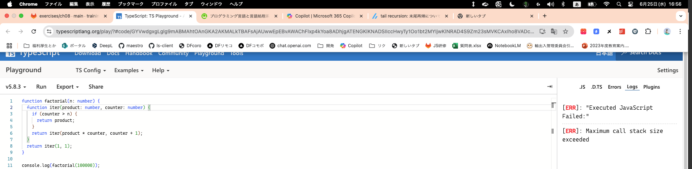
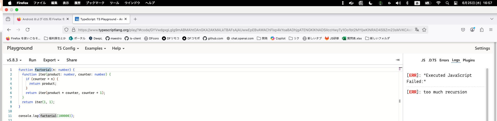

## 1

### 問題

プログラミング言語や処理系によっては、再帰呼び出しを関数の処理の末尾にする(末尾再帰)ことで、 
スタックオーバーフローが起こらないよう最適化できるものがある。末尾再帰は何故そのような最適化ができるのか答えなさい。

### 回答

再起呼び出しが末尾にある場合は、関数の「最後の処理」になるため戻り先の情報を保持する必要がなくなる。 
そのため、現在のスタックフレーム（戻り先やローカル変数の情報）を再利用できるためメモリの無駄も省くことができる

参考：https://zenn.dev/taka_sh/articles/9b38aba2003431

## 2

### 問題

JavaScript で末尾再帰最適化を実装している処理系を答えなさい。 
利用できる環境があれば、実際に以下の URL を表示・実行してエラーが発生しないことを確認しなさい。 
https://www.typescriptlang.org/play?#code/GYVwdgxgLglg9mABMAhtOAnGKA2AKMALkTBAFsAjAUwwEpEBvAWAChFlxp4kYoa8ADhjgATENGKlKNADSIIccHwyTy1Oo1bt2MYIjwKlNRAD4S9Zm23sMVKCAxIho8VADcW7QF9PNuw55lQWExaEQAKnlFMGU5QxjjAGpEAEZaDysfK1t7R0RefhS5NIys1gUwAGc4HCoAOhw4AHM8VHQsXDwUgAZe3tp01iA

### 回答

実装されている処理系は以下のES6仕様に従っているものである。

- Safari
- Babel

### 実行結果

実際にSafariで実行したところ、`Infinity`が結果として出力され、 
他のchrome, FireFoxで実行したところ`Maximum call stack size exceeded `のエラーが発生した

#### Safari

#### Chrome

#### FireFox

