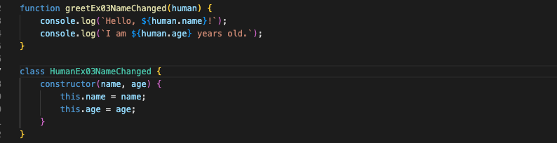

### ex03の結果

結果としてはex03の「Nodeのモジュール」方式でのエクスポートの名前変更では 
インポート先には追従しないことが分かった。 

- エクスポートした名称変更したモジュール
  - 
- インポートしたindex.cjs
  - 

### ex04の結果

結果としてはex04の「ES6のモジュール」方式出のエクスポートの名前変更では 
全てインポート先に追従することが分かった。以下に名称変更したモジュールとそれぞれの結果を記載する

- 名称変更したモジュール
  - 末尾にNameChangedを追加した
    - 
- デフォルトエクスポート
  - デフォルトは任意の名前を決めるため、特に変更は見られなかった
    - 
- 名前変更を伴うインポート
  - エクスポート先のファイルで決めた名称は変わらず、インポート元の名前は変更された
    - 
- 再エクスポート
  - 再エクスポートでは`as`を用いて元の名前を指定するよう変更され、次のインポートにも使えるようになっている
    - 
